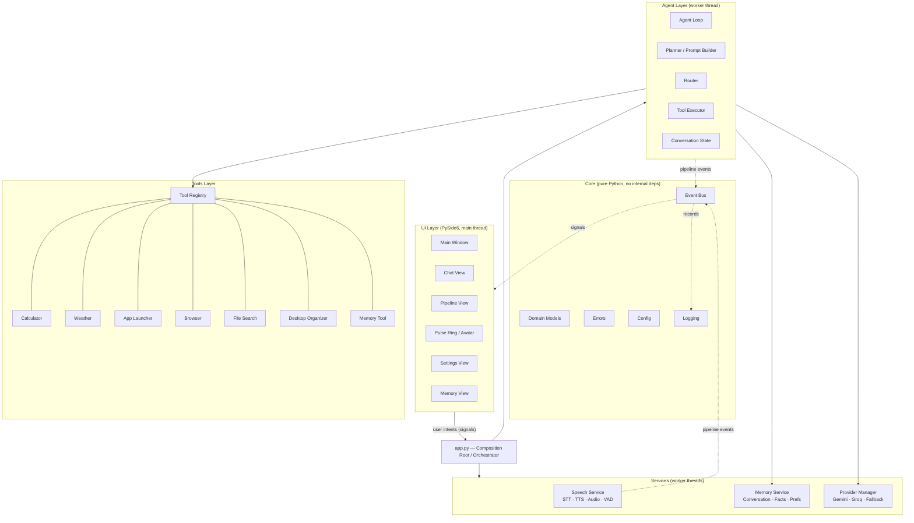
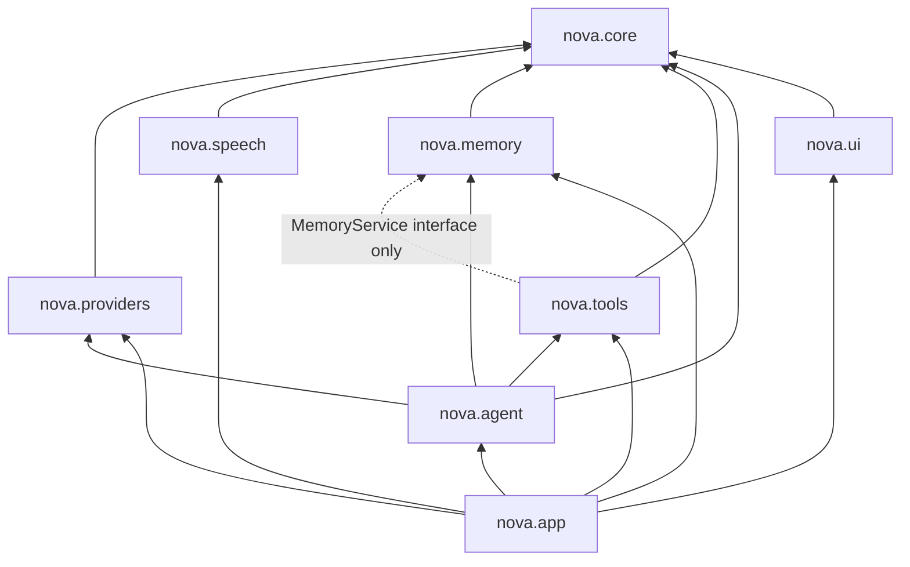

# NOVA — System Architecture

| | |
|---|---|
| **Document** | Phase 3 — Complete System Architecture |
| **Status** | Ready for review |
| **Version** | 1.0.0 |
| **Owner** | Project Lead |
| **Last updated** | 2026-07-08 |
| **Depends on** | [01-project-vision.md](01-project-vision.md), [02-product-requirements.md](02-product-requirements.md) |
| **Feeds into** | Phases 4–11 (each subsystem is detailed in its own phase), Phase 19 (ARCHITECTURE_RULES.md), Phase 20 (implementation order) |

---

## 1. Architectural Principles

Derived from the Vision pillars (P-1…P-5) and design philosophy (Vision §11). These are **rules**, not suggestions; Phase 19 encodes them for AI coding agents.

| # | Principle | Consequence |
|---|-----------|-------------|
| A-1 | **The LLM decides; Python executes.** | Providers return *structured decisions* (tool calls / text). Only the Tool Executor, running validated Python, touches Windows. There is no code path from provider output to OS action that bypasses schema validation. |
| A-2 | **One instrumentation stream, two consumers.** | Pipeline events are the single source of truth. The UI renders them; the logger records them. The visualization can never lie (NG-9) because it has no separate data source. |
| A-3 | **Strict layering, acyclic imports.** | Dependencies point inward only (see §6). `core` imports nothing from other NOVA packages; `ui` never imports `agent`, `tools`, or `providers`. |
| A-4 | **Everything pluggable is behind an interface.** | Tools, LLM providers, STT engines, TTS engines, and memory stores each implement an abstract base class and are registered/injected — never hard-imported by consumers. |
| A-5 | **The UI thread renders; workers work.** | All network, speech, file, and tool operations run in worker threads. Cross-thread communication is Qt signals/slots only. No shared mutable state without ownership. |
| A-6 | **Fail conversationally.** | Every error path terminates in (a) a pipeline error event and (b) a child-friendly assistant message. Exceptions never reach the user as stack traces. |

---

## 2. Architecture at a Glance



Five layers plus a composition root:

1. **Core** — domain models, event bus, errors, config, logging. Depends on nothing internal.
2. **Services** — speech, memory, LLM providers. Depend only on core.
3. **Tools** — the only code that acts on Windows. Depend only on core (+ memory service interface for the Memory Tool).
4. **Agent** — the reasoning loop. Depends on core + service/tool *interfaces*.
5. **UI** — PySide6 widgets. Depends only on core (models + events).
6. **`app.py`** — the composition root: constructs everything, injects dependencies, wires signals. The only module allowed to import from all layers.

---

## 3. Folder Structure

```
nova-ai/
├── README.md
├── pyproject.toml               # Package metadata, deps, tool config (ruff, pytest)
├── .env.example                 # Documented env vars — never real keys (Phase 14)
├── .gitignore
├── docs/                        # All phase documents (this suite)
├── assets/
│   ├── icons/                   # Tool icons, status icons (SVG)
│   ├── fonts/                   # Bundled UI fonts
│   ├── sounds/                  # Listening cues, notification chimes
│   └── styles/                  # QSS stylesheets, theme tokens
├── scripts/
│   ├── run_dev.ps1              # Dev launcher
│   └── build_release.ps1        # Packaging entry point (Phase 14)
├── src/
│   └── nova/
│       ├── __init__.py
│       ├── __main__.py          # `python -m nova`
│       ├── app.py               # Composition root: builds & wires everything
│       │
│       ├── core/                # LAYER 0 — no internal imports
│       │   ├── events.py        # EventBus, PipelineEvent, PipelineStage
│       │   ├── models.py        # UserInput, Transcript, ToolCall, ToolResult, AssistantReply…
│       │   ├── errors.py        # NovaError hierarchy
│       │   ├── config.py        # Settings load/save/validate (.env + settings.json)
│       │   └── logging.py       # Structured logger setup, event→log bridge
│       │
│       ├── providers/           # LAYER 1 — LLM backends
│       │   ├── base.py          # LLMProvider ABC: generate(messages, tools) → LLMResponse
│       │   ├── gemini.py
│       │   ├── groq.py
│       │   └── manager.py       # Selection + fallback strategy (Phase 10)
│       │
│       ├── speech/              # LAYER 1 — audio in/out
│       │   ├── service.py       # SpeechService facade
│       │   ├── audio.py         # Device capture/playback
│       │   ├── vad.py           # Voice activity detection (end-of-speech)
│       │   ├── stt/
│       │   │   ├── base.py      # STTEngine ABC
│       │   │   └── …            # Engine impls (Phase 8 decision)
│       │   └── tts/
│       │       ├── base.py      # TTSEngine ABC
│       │       └── …            # Engine impls (Phase 8 decision)
│       │
│       ├── memory/              # LAYER 1 — persistence
│       │   ├── service.py       # MemoryService facade
│       │   ├── conversation.py  # Session transcripts (JSONL)
│       │   ├── longterm.py      # Facts store (JSON)
│       │   ├── preferences.py   # User preferences (JSON)
│       │   └── retrieval.py     # Context-injection strategy (Phase 9)
│       │
│       ├── tools/               # LAYER 1 — the ONLY code that acts on Windows
│       │   ├── base.py          # Tool ABC + ToolSpec (schema, sensitivity flag, icon)
│       │   ├── registry.py      # ToolRegistry: register, lookup, schemas-for-LLM
│       │   ├── calculator.py
│       │   ├── weather.py
│       │   ├── app_launcher.py
│       │   ├── browser.py
│       │   ├── file_search.py
│       │   ├── desktop_organizer.py
│       │   └── memory_tool.py
│       │
│       ├── agent/               # LAYER 2 — reasoning loop
│       │   ├── agent.py         # Agent: the perceive→reason→act loop (Phase 6)
│       │   ├── planner.py       # Prompt assembly, thinking-summary extraction
│       │   ├── router.py        # Decision parsing: tool call vs direct answer
│       │   ├── executor.py      # Validation, confirmation gate, timeboxed execution
│       │   └── state.py         # ConversationState: turns, iteration cap, context window
│       │
│       └── ui/                  # LAYER 2 — PySide6, imports core only
│           ├── main_window.py
│           ├── theme.py         # Design tokens from Phase 5
│           ├── views/
│           │   ├── chat_view.py
│           │   ├── pipeline_view.py
│           │   ├── settings_view.py
│           │   └── memory_view.py
│           ├── widgets/
│           │   ├── pulse_ring.py
│           │   ├── message_bubble.py
│           │   ├── stage_chip.py
│           │   ├── status_bar.py
│           │   └── confirm_dialog.py
│           └── animations.py    # Shared animation helpers (QPropertyAnimation presets)
│
└── tests/
    ├── unit/                    # Per-module, no I/O, no Qt
    ├── integration/             # Agent+tools+memory with fake provider
    └── ui/                      # pytest-qt widget tests
```

**Runtime user data** (not in repo) lives under `%APPDATA%/NOVA/`: `settings.json`, `memory/`, `conversations/`, `logs/` (Phase 14).

---

## 4. Component Responsibilities

| Component | Single responsibility | Explicitly NOT responsible for |
|-----------|----------------------|-------------------------------|
| `app.py` (Orchestrator) | Construct components, inject dependencies, wire signals, own thread lifecycles, route user intents to the agent worker. | Business logic, rendering, reasoning. |
| `core.events` (EventBus) | Define pipeline stages/events; fan out events to subscribers (UI, logger) thread-safely. | Producing events (producers own that); interpreting them. |
| `core.models` | Typed, immutable data artifacts passed between layers. | Behavior — models are data. |
| `core.config` | Load/validate/persist settings; expose typed access; emit change notifications. | Deciding what settings mean (consumers do). |
| `providers.base` / impls | Translate (messages + tool schemas) → provider API call → normalized `LLMResponse`. | Executing anything; retry policy (manager's job). |
| `providers.manager` | Active-provider selection, fallback on failure, provider status reporting (FR-48). | Prompt content; parsing decisions. |
| `speech.service` | Facade for listen (capture→VAD→STT→Transcript) and speak (text→TTS→playback); emit speech pipeline events. | What to say; when to listen (Orchestrator/UI trigger it). |
| `memory.service` | Persist/retrieve conversations, facts, preferences; provide context snippets for prompts (Phase 9 strategy). | Deciding what to remember (agent/tool decide). |
| `tools.base` (Tool ABC) | Contract: `spec` (name, description, JSON schema, sensitive flag, icon) + `execute(args) → ToolResult`. | Parsing LLM output; UI. |
| `tools.registry` | Register tools, expose schemas to the agent, look up by name, enforce uniqueness. | Executing tools (executor's job). |
| `agent.agent` | The loop: build context → call provider → route decision → (execute tool → feed back)* → final reply. Emits THINKING/…/RESPONDING events. | Rendering; persistence details; provider specifics. |
| `agent.planner` | Assemble system prompt + memory context + history + user input; extract the child-readable thinking summary (FR-18). | Calling the provider. |
| `agent.router` | Classify each `LLMResponse`: tool call(s) vs direct answer; validate structure. | Executing; prompting. |
| `agent.executor` | Validate args against schema (FR-16), enforce confirmation gate for sensitive tools (FR-20), run with timeout (FR-49), normalize `ToolResult`. | Choosing the tool (LLM did); rendering confirmation UI (emits request, UI answers). |
| `agent.state` | Hold conversation turns, enforce iteration cap (FR-17), manage context-window trimming. | Long-term persistence (memory service). |
| `ui.*` | Render state from pipeline events + view models; capture user input; never compute business results. | Reasoning, tool logic, direct provider/tool imports (A-3). |

---

## 5. Runtime & Threading Model

```
Process: single Python process
│
├── Main thread (Qt event loop)          — UI rendering, animations, user input
├── AgentWorker (QThread)                — agent loop, provider HTTP calls, tool execution
├── SpeechInWorker (QThread)             — audio capture, VAD, STT
└── SpeechOutWorker (QThread)            — TTS synthesis, audio playback
```

**Rules (binding, restated in Phase 19):**

1. Only the main thread touches Qt widgets.
2. Workers communicate exclusively via Qt signals carrying `core.models` objects (immutable).
3. One request is processed at a time (single AgentWorker job queue). New input during processing is rejected with a visible "one moment" state — deliberate simplicity for v1.0 and for pedagogy.
4. TTS playback may overlap the return to `IDLE` (the user can read/scroll while NOVA finishes speaking); pressing talk again stops playback (FR-13).
5. Tool execution runs inside AgentWorker under a watchdog timeout (FR-49). Tools must be cancellable-by-abandonment (no cleanup that can corrupt state if abandoned — enforced by move-then-commit patterns in file tools).

---

## 6. Dependency Graph & Import Rules



| Rule | Statement |
|------|-----------|
| D-1 | `core` imports nothing from `nova.*`. |
| D-2 | `providers`, `speech`, `memory` import only `core`. |
| D-3 | `tools` import `core`; `memory_tool` may additionally receive (not import-construct) the `MemoryService` via injection. |
| D-4 | `agent` imports `core` + the ABCs of `providers`, `tools`, `memory`. Never `ui`, never concrete provider classes. |
| D-5 | `ui` imports `core` only. It learns everything from events and view models. |
| D-6 | `app.py` is the only module that may import everything. All wiring lives here. |
| D-7 | No module imports `app.py`. |

A CI lint (import-linter contract, Phase 13) enforces D-1…D-7 mechanically.

---

## 7. Data Flow — Pipeline Events & Data Artifacts

### 7.1 Pipeline stages

Internal enum → child-facing label (UI copy finalized in Phase 5):

| `PipelineStage` | Child label | Emitted by |
|-----------------|-------------|-----------|
| `IDLE` | — | Orchestrator |
| `LISTENING` | "Listening…" | SpeechService |
| `TRANSCRIBING` | "Understanding your words" | SpeechService |
| `THINKING` | "Thinking…" | Agent |
| `SELECTING_TOOL` | "Choosing a tool" | Agent (router) |
| `AWAITING_CONFIRMATION` | "Asking your permission" | Executor |
| `EXECUTING` | "Doing it on your PC" | Executor |
| `OBSERVING` | "Checking the result" | Agent (feedback step) |
| `REMEMBERING` | "Remembering" | Agent/MemoryService |
| `RESPONDING` | "Getting my answer ready" | Agent |
| `SPEAKING` | "Speaking" | SpeechService |
| `ERROR` | "Oops — something went wrong" | Any producer |

Every event: `PipelineEvent(stage, status ∈ {started, completed, skipped, failed}, detail: str, payload, request_id, timestamp)`. The `detail` string is the plain-language description shown in the UI (FR-37) and written to logs (A-2).

### 7.2 Data artifacts (in `core.models`)

```
UserInput(request_id, text, source: voice|typed, ts)
Transcript(request_id, text, confidence)
AgentThought(request_id, summary)                     # child-readable, FR-18
ToolCall(call_id, tool_name, arguments: dict)
ToolResult(call_id, status: ok|error|timeout|denied, data, error_message, duration_ms)
AssistantReply(request_id, text, spoken_text)          # spoken_text may be a shortened form
MemoryItem(id, kind: fact|preference, content, created_at)
```

All artifacts are frozen dataclasses — safe to pass across threads by value.

---

## 8. Execution Flow — One Request, End to End

```mermaid
sequenceDiagram
    autonumber
    participant U as User
    participant UI as UI (main thread)
    participant OR as Orchestrator
    participant SP as SpeechIn
    participant AG as Agent (worker)
    participant PM as Provider Mgr
    participant LLM as Cloud LLM
    participant EXE as Executor
    participant T as Tool (Python)
    participant MEM as Memory
    participant TTS as SpeechOut

    U->>UI: press Talk, speak request
    UI->>OR: startListening()
    OR->>SP: capture()
    SP-->>UI: LISTENING started
    SP-->>UI: TRANSCRIBING → Transcript("what's the weather in Lagos")
    OR->>AG: handle(UserInput)
    AG-->>UI: THINKING started
    AG->>MEM: getContext(input)
    MEM-->>AG: relevant facts + recent turns
    AG->>PM: generate(messages, tool_schemas)
    PM->>LLM: API call (primary; fallback on failure)
    LLM-->>PM: decision: ToolCall(weather, {city: "Lagos"})
    PM-->>AG: LLMResponse
    AG-->>UI: SELECTING_TOOL → "Weather tool"
    AG->>EXE: execute(ToolCall)
    EXE->>EXE: validate args vs schema (FR-16)
    EXE-->>UI: EXECUTING → "Checking the weather in Lagos"
    EXE->>T: run(args) [timeout 15s]
    T-->>EXE: ToolResult(ok, {temp: 31, …})
    EXE-->>AG: ToolResult
    AG-->>UI: OBSERVING
    AG->>PM: generate(messages + tool result)
    LLM-->>AG: final answer text
    AG->>MEM: persist turn (+ facts if any)
    AG-->>UI: REMEMBERING · RESPONDING → AssistantReply
    OR->>TTS: speak(reply.spoken_text)
    TTS-->>UI: SPEAKING started/completed
    UI-->>U: bubble + voice: "It's 31° and sunny in Lagos!"
```

Typed input enters at step 6 (`handle(UserInput)`) with LISTENING/TRANSCRIBING emitted as `skipped` (FR-38). Direct answers (no tool) skip steps 13–21 with SELECTING_TOOL/EXECUTING marked `skipped` (FR-7).

---

## 9. Agent Flow

The agent is a bounded loop (detailed in Phase 6):

```
build context ─→ LLM call ─→ route decision
                                  │
              ┌───────────────────┴─────────────────┐
              ▼                                     ▼
        tool call(s)                          direct answer
              │                                     │
   validate → confirm? → execute              compose reply
              │                                     │
        append result to context                    ▼
              │                                   DONE
              └──── loop (max 5 iterations) ────────┘
```

- **Planner** builds: system prompt (identity, safety, child-appropriate tone — NFR-7) + memory context + trimmed history + user input.
- **Router** parses the provider-normalized response into `ToolCall[]` or final text; malformed tool calls trigger one repair round-trip, then error (FR-16, R-6).
- **Executor** owns the confirmation gate: sensitive tools emit `AWAITING_CONFIRMATION`; the UI answers via signal; denial returns `ToolResult(denied)` which the LLM turns into a polite response (FR-20).
- Iteration cap (default 5) prevents loops (FR-17). On cap: apologetic reply + ERROR event.

## 10. Speech Flow

```
IN:  mic → AudioCapture ── frames ──→ VAD (end-of-speech) ──→ STT engine ──→ Transcript → Agent
      └─ LISTENING event                └─ stops capture        └─ TRANSCRIBING event

OUT: AssistantReply.spoken_text → TTS engine → audio playback → SPEAKING events
                                        └─ interruptible (FR-13)
```

- Push-to-talk in v1.0: capture starts on user action, ends on VAD silence or re-press (NG re wake word; Phase 8 specs it for later).
- The transcript is **always displayed before the agent acts** (FR-8, R-2) — mistranscriptions become teachable moments, not silent failures.
- Engines are behind `STTEngine`/`TTSEngine` ABCs (A-4); concrete choices are a Phase 8 decision (cloud STT vs light local, Windows-native vs neural TTS).

## 11. Memory Flow

Three stores, one service (details/format in Phase 9):

| Store | Content | Lifecycle | Written by |
|-------|---------|-----------|-----------|
| Conversation | Full turn history (JSONL per session) | Append-only; browsable (FR-5) | Agent (every turn) |
| Long-term facts | User-stated facts (JSON) | Until user deletes (FR-33) | Memory Tool (explicit "remember…") |
| Preferences | Settings-adjacent user prefs (JSON) | Until changed | Memory Tool / Settings |

**Read path (per request):** `MemoryService.getContext(input)` returns recent-N turns + keyword-relevant facts + preferences → injected by Planner. Retrieval strategy (keyword now, vector future) is Phase 9.
**Write path:** explicit memory writes go through the Memory Tool (visible REMEMBERING stage — EO-5); conversation turns persist automatically at RESPONDING.

## 12. UI Flow

UI state machine (mirrors pipeline, drives PulseRing + input affordances):

```
        ┌────────────────────────────────────────────────┐
        ▼                                                │
      IDLE ──talk──→ LISTENING ──transcript──→ PROCESSING ──reply──→ SPEAKING
        │                │                        │  ▲                  │
        │              cancel                     │  └─ confirmation ◄──┤
        └──type+enter────┴──────────→ PROCESSING ─┘     dialog          │
        ▲                                                               │
        └───────────────── done / interrupted ──────────────────────────┘
                     (any state) ──failure──→ ERROR ──acknowledge──→ IDLE
```

- Views (Chat, Pipeline, Memory, Settings) are independent subscribers to the EventBus — no view depends on another (A-3).
- `AWAITING_CONFIRMATION` raises a modal confirm dialog (FR-20); the answer is signaled back to the Executor.
- Screen inventory, layouts, and animation specs are Phase 5.

## 13. Tool Flow

**Registration (startup):** each tool module defines a `Tool` subclass with a `ToolSpec` → `app.py` instantiates and registers it → registry rejects duplicate names → registry renders schemas once for the provider layer.

**Invocation (per call):**

```
LLM decision → Router parses ToolCall → Registry lookup (unknown name → repair round-trip)
  → Executor: schema-validate args → sensitive? → UI confirmation → run with timeout
  → ToolResult (ok | error | timeout | denied) → back to Agent context → UI events throughout
```

**The Tool contract** (full spec in Phase 7): `name`, `description` (written for the LLM), `parameters` (JSON Schema), `sensitive: bool`, `icon`, `execute(args, context) → ToolResult`. Tools receive a narrow `ToolContext` (config, memory interface where justified) — never the agent, provider, or UI (A-1, A-3).

---

## 14. Error Handling Architecture

Error hierarchy in `core.errors`:

```
NovaError
├── ConfigError          # bad/missing settings, API keys (FR-47)
├── ProviderError        # LLM API failures → triggers fallback (FR-48)
│   ├── AuthError        # bad key — never retried (Phase 10 §3.2)
│   ├── RateLimited      # throttled; honors retry_after if given
│   ├── Transient        # timeout/5xx — worth one same-provider retry
│   └── SafetyBlocked    # hard block, no candidate at all — never retried/falls back
├── SpeechError          # mic/STT/TTS failures (SC-6)
├── ToolError            # tool execution failures
│   ├── ToolTimeout      # watchdog fired (FR-49)
│   ├── ToolDenied       # user refused confirmation
│   └── ToolInvalidArgs  # schema validation failed (FR-16)
└── MemoryError          # persistence failures
```

Uniform handling (A-6): catch at layer boundary → emit `PipelineEvent(ERROR, detail=friendly text)` → log with full context (NFR-14) → agent converts to conversational reply where a conversation is active. The app never crashes on a handled `NovaError`; unhandled exceptions hit a top-level hook that logs, shows a friendly dialog, and keeps the app alive.

---

## 15. Configuration Architecture

- **Secrets** (API keys): environment variables via `.env` (dev) or `%APPDATA%/NOVA/.env` (installed); never in `settings.json`, never committed (NFR-8).
- **Settings** (`%APPDATA%/NOVA/settings.json`): provider selection, voice on/off, devices, default city, accent color. Typed access through `core.config.Settings`; change notifications let the provider manager hot-swap without restart (US-12).
- **Defaults in code**, overrides in file — a missing/corrupt settings file yields a working app with defaults plus a warning (SC-6 spirit).

---

## 16. Extension Points (G-8)

| To add… | You touch… | You do NOT touch… |
|---------|-----------|-------------------|
| A new Tool | new module in `tools/` + one registration line in `app.py` | agent, ui, providers |
| A new LLM provider | new module in `providers/` + manager registration | agent, tools, ui |
| A new STT/TTS engine | new module under `speech/stt|tts/` | agent, ui |
| A new UI view | new module in `ui/views/` subscribing to EventBus | agent, tools, providers |
| Vector memory (future) | `memory/retrieval.py` implementation swap | agent (uses `getContext` interface) |

---

## 17. Architecture Decisions Deferred to Phase 4

These are *shaped* here but *justified* there: exact STT/TTS engines, HTTP client, JSON-schema validation library, packaging tool, threading (QThread chosen over asyncio — rationale in Phase 4), config format, logging library.

---

## 18. Revision History

| Version | Date | Change |
|---------|------|--------|
| 1.0.0 | 2026-07-08 | Initial version for Phase 3 review. |

---

## 19. Phase 3 Exit — Review Checklist

- [ ] Layering and import rules (D-1…D-7) agreed — they will be mechanically enforced
- [ ] Threading model (single AgentWorker, one request at a time) agreed
- [ ] Pipeline stage list and child labels agreed (they anchor UI and teaching)
- [ ] Folder structure agreed (Phase 20 generates milestones from it)
- [ ] Confirmation-gate placement (Executor-owned, UI-answered) agreed
- [ ] Error hierarchy and fail-conversationally policy agreed

**On approval → Phase 4: Technology Decisions.**
