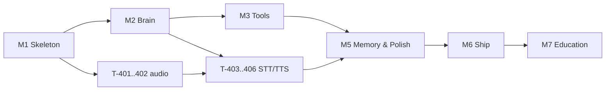

# NOVA — Development Roadmap

| | |
|---|---|
| **Document** | Phase 12 — Development Roadmap |
| **Status** | Ready for review |
| **Version** | 1.0.0 |
| **Last updated** | 2026-07-08 |
| **Depends on** | Phase 2 (§8 milestones, MoSCoW), Phases 3–11 (scope of each subsystem) |
| **Feeds into** | Phase 20 (implementation order, branches), GitHub issues |

Assumes a solo developer, part-time (~10–12 h/week). One sprint = one week. Efforts are ideal hours (multiply by your honesty factor). Every task becomes a GitHub issue via the Phase 20 templates; IDs here are stable.

---

## 1. Milestones & Definition of Done

| Milestone | Sprints | DoD (demoable statement) |
|---|---|---|
| **M1 — Skeleton & Shell** | S1–S2 | App launches: dark themed window, pulse ring idling, fake pipeline animates from a debug button. CI green (lint, types, import contracts, unit tests). |
| **M2 — Talking Brain (typed)** | S3–S4 | Typed conversation end-to-end with real Gemini + Groq, fallback working, pipeline showing THINKING/RESPONDING truthfully. No tools yet. |
| **M3 — Hands (tools)** | S5–S7 | All 7 tools callable by the LLM; confirmation gate + undo working; pipeline shows tool stages; FakeProvider integration suite green. |
| **M4 — Ears & Voice** | S8–S9 | Push-to-talk voice loop: speak → transcript → answer spoken (edge-tts, pyttsx3 fallback). Devices selectable. SC-1 demonstrable. |
| **M5 — Memory & Polish** | S10–S11 | Facts persist across restart (SC-4); Memory View + History drawer; animations/motion per Phase 5; perf pass on reference hardware (SC-7/8). |
| **M6 — Ship** | S12–S13 | PyInstaller build runs on a clean Win 11 VM; docs synced; v1.0.0 tagged & released. Full manual test checklist green (SC-1…SC-10). |
| **M7 — Education Track** | S14 | Phases 15–16 written; demo rehearsed against the shipped build (SC-11…SC-13). |

## 2. Task Backlog

### M1 — Skeleton & Shell
| ID | Task | Est (h) | Depends |
|----|------|--------|---------|
| T-101 | Repo bootstrap: pyproject, ruff/mypy/pytest config, uv lock, CI workflow (lint+test on windows-latest) | 4 | — |
| T-102 | `core.models` + `core.events` (EventBus w/ Qt bridge) + unit tests | 5 | T-101 |
| T-103 | `core.config` (pydantic-settings, .env, settings.json, atomic writes) + tests | 4 | T-101 |
| T-104 | `core.logging` (rotating file, event→log bridge, rich dev console) | 3 | T-102 |
| T-105 | `core.errors` hierarchy + top-level exception hook | 2 | T-101 |
| T-106 | Theme system: tokens → `theme.py` + QSS, fonts bundled | 5 | T-101 |
| T-107 | Main window layout: header, chat pane, pipeline panel, input bar (static) | 6 | T-106 |
| T-108 | PulseRing widget: all 6 states + animations | 6 | T-106 |
| T-109 | StageChip + stage rail rendering from PipelineEvents (debug emitter) | 5 | T-102, T-107 |
| T-110 | import-linter contracts D-1…D-7 wired into CI | 2 | T-101 |
| | **M1 subtotal** | **42** | |

### M2 — Talking Brain
| ID | Task | Est (h) | Depends |
|----|------|--------|---------|
| T-201 | `ChatMessage` normalization + `LLMProvider` ABC + errors | 3 | T-102 |
| T-202 | Gemini adapter + golden-fixture tests ⚠️ verify model id | 5 | T-201 |
| T-203 | Groq adapter + golden-fixture tests ⚠️ verify model id | 4 | T-201 |
| T-204 | ProviderManager: selection, retry, fallback, cooldown, status events | 5 | T-202, T-203 |
| T-205 | System prompt v1 (`prompts/system.md`) + Planner (context assembly, thinking-summary) | 5 | T-201 |
| T-206 | Router + ConversationState (trimming, iteration cap) | 4 | T-205 |
| T-207 | Agent loop (no tools): handle→reply; AgentWorker thread + cancellation | 5 | T-206 |
| T-208 | Chat view: bubbles, entry animation, history scroll; input wiring | 5 | T-107, T-207 |
| T-209 | Settings view: provider section, key entry+test, hot-swap | 5 | T-103, T-204 |
| T-210 | FakeProvider + integration test harness (recorded events assertions) | 4 | T-207 |
| | **M2 subtotal** | **45** | |

### M3 — Hands
| ID | Task | Est (h) | Depends |
|----|------|--------|---------|
| T-301 | Tool ABC + ToolSpec + Registry + schema generation + drift test | 5 | T-201 |
| T-302 | Executor: validation, sensitive gate, watchdog timeout, ToolResult | 5 | T-301, T-207 |
| T-303 | Agent loop tool iterations + repair round-trip + OBSERVING events | 4 | T-302 |
| T-304 | calculator + tests | 3 | T-301 |
| T-305 | weather (geocode, cache) + tests | 4 | T-301 |
| T-306 | browser + tests | 3 | T-301 |
| T-307 | app_launcher (alias map, Start Menu index, fuzzy match) + tests | 6 | T-301 |
| T-308 | file_search + tests | 5 | T-301 |
| T-309 | desktop_organizer (plan/preview/act/undo, manifest) + tests | 8 | T-302 |
| T-310 | memory_tool (against MemoryService stub) + tests | 3 | T-301 |
| T-311 | Confirmation dialog + AWAITING_CONFIRMATION wiring | 4 | T-302, T-107 |
| T-312 | Pipeline panel: tool icon/detail display, skipped stages, expandable details | 4 | T-109, T-303 |
| | **M3 subtotal** | **54** | |

### M4 — Ears & Voice
| ID | Task | Est (h) | Depends |
|----|------|--------|---------|
| T-401 | Audio capture (sounddevice) + level meter signal + device enumeration | 5 | T-102 |
| T-402 | VAD endpointing + push-to-talk state machine + cues | 5 | T-401 |
| T-403 | Groq Whisper STT engine + error matrix + tests (recorded fixtures) | 4 | T-401 |
| T-404 | edge-tts engine: streaming synth→playback; strip-markdown | 5 | T-102 |
| T-405 | pyttsx3 fallback + auto-switch + "Voice: offline" status | 3 | T-404 |
| T-406 | Speak/stop/interrupt wiring (bubble glyph, mic interrupt) | 3 | T-404 |
| T-407 | Settings: voice section (voice pick, devices, mic test) | 4 | T-401, T-209 |
| T-408 | Voice E2E happy path + failure drills (mic gone, offline) | 4 | T-402…T-406 |
| | **M4 subtotal** | **33** | |

### M5 — Memory & Polish
| ID | Task | Est (h) | Depends |
|----|------|--------|---------|
| T-501 | MemoryService: facts store, atomic IO, keyword retrieval + tests | 6 | T-103 |
| T-502 | Conversation persistence (JSONL, index, stages record) | 4 | T-501 |
| T-503 | Planner memory-context injection + REMEMBERING events | 3 | T-501, T-205 |
| T-504 | Memory View (list, delete, clear-all, empty state) | 4 | T-501 |
| T-505 | History drawer (sessions, read-only replay) | 4 | T-502 |
| T-506 | Motion pass: all Phase 5 §8 tokens, reduced-motion setting | 4 | M3, M4 |
| T-507 | Perf pass on reference HW: RAM audit, fps check, latency timings | 5 | all |
| T-508 | Copy pass: every child-facing string vs Phase 5 §9 | 2 | all |
| | **M5 subtotal** | **32** | |

### M6 — Ship
| ID | Task | Est (h) | Depends |
|----|------|--------|---------|
| T-601 | PyInstaller spec: hooks, assets, icon, version stamp | 6 | M5 |
| T-602 | Clean-VM smoke test protocol + fixes | 4 | T-601 |
| T-603 | First-run experience: welcome, key setup guidance | 3 | T-209 |
| T-604 | Manual acceptance run: full checklist SC-1…SC-10, US acceptance | 5 | all |
| T-605 | Docs sync sweep + CHANGELOG + v1.0.0 release | 4 | all |
| | **M6 subtotal** | **22** | |

**Total: ~228 ideal hours ≈ 13–14 sprints at 10–12 h/week + M7.** Matches the PRD §8 envelope (13–17 weeks).

## 3. Priority Matrix

| | **Low effort** | **High effort** |
|---|---|---|
| **High impact** | T-304/305/306 (quick tool wins), T-405 (fallback voice), T-110 (arch enforcement) | T-108 (pulse ring), T-309 (organizer), T-204 (fallback), M4 speech chain |
| **Low impact** | T-508 (copy pass — cheap, do late), cues | T-505 (history replay — S-priority, first candidate to slip to 1.0.x) |

Slip order under schedule pressure (PRD MoSCoW): T-505 → T-506 partial → FR-48 fallback (keep single provider) → never slip: confirmation gate, transcript-before-acting, pipeline truthfulness.

## 4. Dependency Map

Audio capture (T-401/402) is deliberately parallel-safe: it can be built during M2/M3 gaps as a change of pace — it depends only on `core`.

## 5. Standing Rules

- ⚠️ items from Phase 4/10 (model ids, edge-tts viability, lockfile tool) are resolved in the first task that touches them; findings amend the docs.
- A milestone is done when its DoD statement is *demoed*, its tests are green in CI, and touched docs are synced (PROJECT_RULES.md, Phase 19).
- No task starts outside the current milestone without a written reason (scope discipline, R-9).

---

## Revision History

| Version | Date | Change |
|---------|------|--------|
| 1.0.0 | 2026-07-08 | Initial version for Phase 12 review. |

**Exit check:** every FR maps into a task; effort totals fit the PRD envelope; slip order agreed; every task ≤ 8 h (splittable into one sitting).
